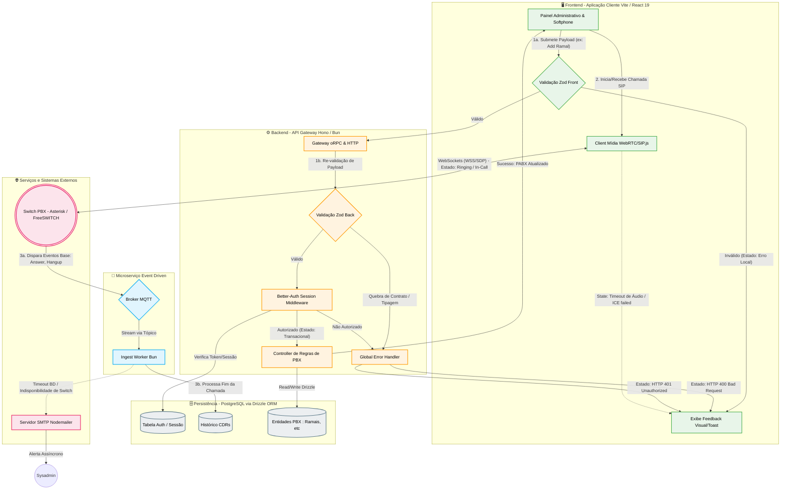

# Documento Técnico: Stack-PBX

## 1. Visão Geral do Sistema

**Nome do Projeto:** Stack-PBX
**Descrição:** Plataforma moderna de PABX (Private Branch Exchange) e gerenciamento de chamadas na nuvem. O sistema permite o provisionamento de ramais, roteamento de chamadas, comunicação em tempo real via WebRTC (SIP), integração de eventos e relatórios detalhados, provendo um painel gerencial unificado.

**Objetivo Principal:** Fornecer uma solução escalável, de alto desempenho e fácil manutenção para o gerenciamento de comunicações unificadas, substituindo infraestruturas tradicionais por uma arquitetura web-first moderna, unindo um backend de telecomunicações com uma interface web rica.

---

## 2. Funcionalidades do Sistema

### 2.1 Funcionalidades Principais (Core)
- **Autenticação e Autorização Segura:** Login, gestão de sessões e controle de acesso baseado em escopos (usando `better-auth`).
- **Comunicação WebRTC / SIP:** Realização e recebimento de chamadas diretamente pelo navegador utilizando o frontend (`sip.js`).
- **Gerenciamento de Entidades do PABX:** Criação e configuração de ramais, filas de atendimento, rotas de entrada e saída.
- **Processamento de Eventos em Tempo Real:** Ingestão contínua de status de dispositivos e chamadas através de eventos assíncronos (uso de MQTT).
- **Relatórios e Analytics:** Dashboards de estatísticas de chamadas e histórico interativo.

### 2.2 Funcionalidades Secundárias
- **Processamento de Áudio:** Manipulação de arquivos de mídia (ex: saudações, gravações de chamadas) via `fluent-ffmpeg`.
- **Notificações:** Envio de alertas e comunicados transacionais por e-mail (`nodemailer`).
- **Painel Responsivo:** Suporte a múltiplos dispositivos e suporte a *Dark Mode* contínuo.

---

## 3. Arquitetura do Sistema

A arquitetura foi desenhada utilizando o modelo de **Monorepo** (gerenciado com *Turborepo*), centralizando múltiplos pacotes e aplicações. A linguagem base em todos os níveis é **TypeScript**, e o runtime escolhido para ganho exponencial de performance no backend é o **Bun**.

### 3.1 Arquitetura de Alto Nível
- **Frontend (Web):** SPA (Single Page Application) focada em UX/UI responsivo e estado altamente reativo.
- **Backend (Server):** API HTTP leve e baseada em RPC para comunicação tipada com o frontend, responsável pela regra de negócios e conectividade do PABX.
- **Microserviço (Ingest):** Worker dedicado ao recebimento de altíssimo tráfego de eventos do PABX/Sensores via MQTT, separando o peso de telemetria da API principal.
- **Banco de Dados (DB):** Relacional com forte restrição de integridade (PostgreSQL sugerido), interagindo através de queries seguras.

---

## 4. Stack Tecnológica Moderna

A pilha tecnológica foi criteriosamente escolhida com base em performance extrema, forte tipagem fim-a-fim, e manutenibilidade.

**Workspace & Tooling**
- Gerenciador de Pacotes e Runtime: **Bun**
- Monorepo: **Turborepo**
- Linting/Formatting: **Oxlint** & **Oxfmt**

**Frontend (`apps/web`)**
- Core: **React 19** com **Vite**
- Roteamento: **TanStack Router** (Type-safe routing)
- Gerenciamento de Estado de Dados: **TanStack Query**
- Formulários: **TanStack Form** e *Zod*
- Comunicação de Voz: **SIP.js** (WebRTC/SIP)
- Estilização & UI: **TailwindCSS v4**, **shadcn/ui**, **Base UI**
- Gráficos: **Recharts**

**Backend / API (`apps/server`)**
- Core HTTP: **Hono**
- Camada RPC Transportável: **oRPC** (Type-safe APIs)
- Autenticação: **Better-Auth**
- Processamento Auxiliar: **Fluent-FFmpeg** (áudio), **Nodemailer**

**Serviço de Eventos (`apps/ingest`)**
- Mensageria de Dados IoT/PABX: **MQTT**

**Camada de Dados (`packages/db`)**
- ORM: **Drizzle ORM** (Type-safe)
- Banco de Dados: **PostgreSQL** (Diferencial na escalabilidade relacional)

---

## 5. Fluxo de Operação e Dados

1. **Interação do Usuário:** O usuário acessa a aplicação Frontend, gerando a renderização rápida via Vite e TanStack Router.
2. **Autenticação:** O componente cliente contata o `apps/server` (Better-Auth). Em caso de sucesso, uma sessão segura é estabelecida.
3. **Comandos (RPC):** Ações como "Criar Ramal" são enviadas via *oRPC* Client para o *oRPC* Server (Hono) no `apps/server`, com validação instantânea nativa através do Zod (Frontend e Backend compartilham a mesma tipagem).
4. **Chamadas (SIP/WebRTC):** O frontend se conecta diretamente ao servidor PABX (Asterisk/FreeSWITCH/Kamailio) via `sip.js` através de WebSockets (WSS). A negociação de mídia flui do browser do usuário até o switch.
5. **Ingestão de Eventos:** O core PABX emite disparos das chamadas (Ring, Answer, Hangup) para o Broker MQTT. O `apps/ingest` processa as mensagens, persiste na base via Drizzle ORM e pode disparar webhooks ou atualizar o cache, garantindo que o servidor principal da API não engargale com processamento de eventos.

---

## 6. Modelagem de Dados Sugerida (Entidades e Relacionamentos)

Utilizando conceitos base para PBXs modernos, sugerimos relatar as entidades em Drizzle Schema:

* **Users/Accounts:**
  - `id`, `email`, `password_hash`, `role` (Admin, Agent, Manager), `created_at`.
* **Extensions (Ramais):**
  - `id`, `user_id` (FK), `extension_number`, `sip_password`, `status` (Online/Offline), `caller_id`.
* **Call Detail Records (CDRs - Histórico de Chamadas):**
  - `id`, `caller_number`, `callee_number`, `start_time`, `answer_time`, `end_time`, `duration`, `disposition` (Answered, Busy, Failed), `recording_url`.
* **Trunks (Troncos de Operadora):**
  - `id`, `name`, `host`, `port`, `username`, `password`.
* **Inbound Routes (Rotas de Entrada):**
  - `id`, `did_number`, `destination_type` (Queue, Extension, IVR), `destination_id`.

**Relacionamentos Base:**
- `User` 1:N com `Extensions` (Um usuário pode ter múltiplos terminais).
- `Extensions` 1:N com `CDRs` (Várias chamadas por ramal).

---

## 7. Estratégias de Segurança

- **Proteção de Autenticação:** `better-auth` para tratamento de senhas seguro e proteção automática de CSRF, session hijacking e geração de tokens via cookies `HttpOnly`.
- **Validação E estrita:** `Zod` assegura que nenhum *payload* mal formato entre no DB. Proteção absoluta contra *Mass Assignment* e injeções de parâmetros.
- **Segurança de APIs:** Rate limiting implementado (`hono-rate-limiter`) na API do Hono.
- **Tipagem End-to-End:** Redução drástica da superfície de bugs devido o uso massivo de interfaces estritas no oRPC entre backend e frontend.
- **Tráfego Criptografado:** TLS/WSS forçado nas comunicações SIP.

---

## 8. Estratégia de Infraestrutura, Deploy e CI/CD

### 8.1 CI/CD (Sugestão via GitHub Actions / GitLab CI)
1. **Lint & Format:** Rodar `oxlint` e `oxfmt --check` na PR.
2. **Type Checking:** Rodar `turbo check-types`.
3. **Database Migrations:** Gerar/Verificar Drizzle migrations.
4. **Build Distribution:** Turbo Pipeline executa o build das packages, e logo depois `apps/server`, `apps/ingest` (Bun compile) e `apps/web` (Vite build).

### 8.2 Infraestrutura & Deployment
- Uso de **Docker Compose** nativo do monorepo para serviços.
- **Deploy do Backend (Server/Ingest):** Utilizando *Bun* para compilação nativa em binários standalone ou imagens leves do Alpine Docker com o script `bun build --compile --minify`.
- **Deploy do Frontend:** Hospedagem como arquivos estáticos puros num CDN (ex. Vercel, Cloudflare Pages ou AWS CloudFront+S3).
- **Tráfego e Routing:** NGINX ou Traefik gerando o SSL/TLS e fazendo Load Balancing direcionado à porta do Hono e servindo WSS para WebRTC e MQTTs para Ingest.

---

## 9. Roadmap de Desenvolvimento (Visão Macro)

**Fase 1: Fundação & Setup (✓ Atual)**
- Definição do Monorepo com Turborepo e Bun.
- Implementação dos módulos base: Tipagem, Banco de Dados, Autenticação (Better-Auth).

**Fase 2: Core do PABX & Gestão**
- CRUD completo de Ramais, Troncos e Rotas via oRPC e React Hook Form.
- Sincronização desses dados com o motor do PABX (ex: Asterisk Realtime DB / ARI API).

**Fase 3: Comunicação & Softphone (WebRTC)**
- Implementação de um Softphone embutido no Painel Web (`apps/web` usando `sip.js`).
- Gestão de microfone, áudio e ringing (UI animations usando `tw-animate-css`).

**Fase 4: Ingestão de Dados & Real-time**
- Finalização do `apps/ingest` escutando eventos via MQTT do PABX.
- População da base de CDRs em tempo real.

**Fase 5: Analytics & Melhorias**
- Dashboards dinâmicos com *Recharts* exibindo duração média das chamadas, fila de abandono.
- Refinamentos no design system (Base-UI/Shadcn).
- Integrações avançadas por voz e áudios usando `fluent-ffmpeg`.

---

## 10. Diagrama de Arquitetura e Fluxo

O fluxo arquitetural abaixo descreve a interação entre os componentes e os microsserviços do **Stack-PBX**, englobando desde a interface até persistência e gestão de chamadas WebRTC em tempo real com eventos MQTT.

---
*Este documento atua como o North-star técnico do projeto e deve evoluir em conjunto ao desenvolvimento das bibliotecas e requisitos propostos.*
